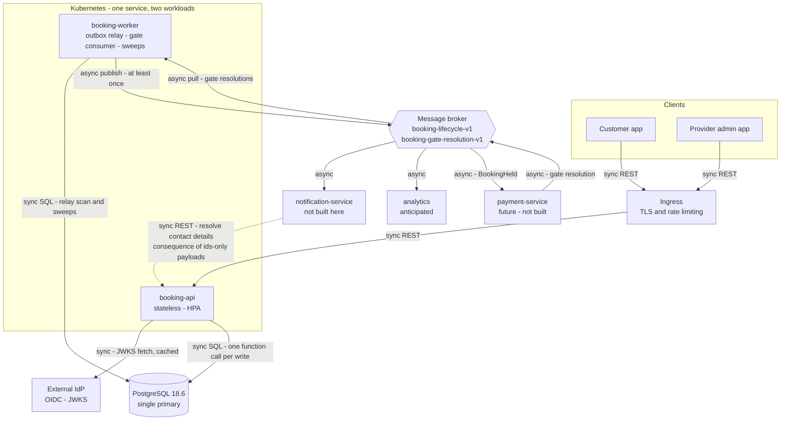
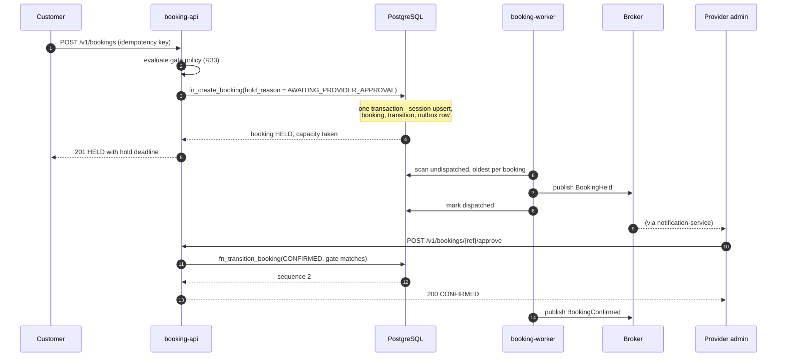
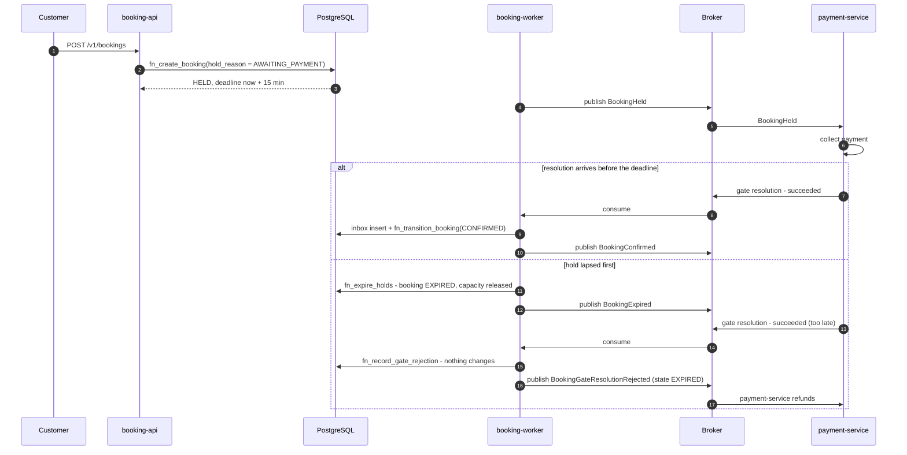
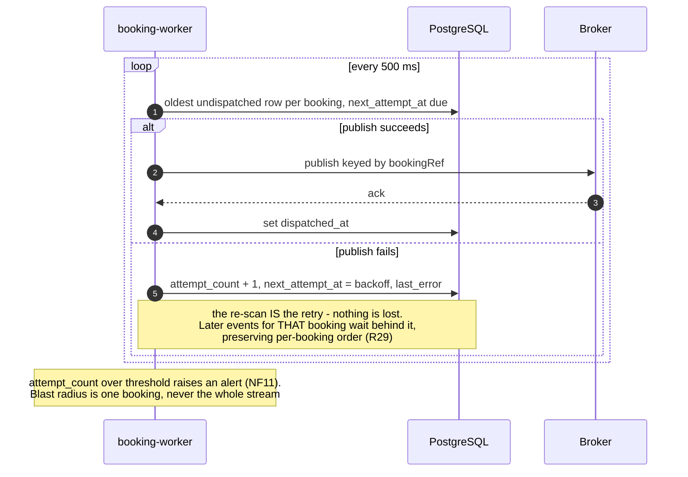

# Booking Service — Architecture Design

Status: **approved at the phase-2 review gate**
Amendments: phase 3 moved the PostgreSQL pin from 16 to 18.6 (stack-selection.md
§8) and resolved PD15 to Apache Kafka 4.3.1 against the §6.1 capability contract —
both await confirmation at the phase-3 gate.
Date: 2026-08-24
Inputs: `requirements.md` r5, `data-design.md` (both approved)
Artifacts: this document. No `openapi/` — see AQ8.

---

## 1. Requirements interpretation

### 1.1 What is already decided

Requirements settled more of this phase than usual, and those are inputs, not
choices to revisit:

- **LD14** — integration is event-driven. This service publishes every booking
  transition to one versioned stream and consumes gate resolutions. It never
  calls a consumer.
- **LD11** — Kubernetes, cloud-agnostic. No vendor-managed service may be
  load-bearing.
- **PD17** — event payloads carry **identifiers only**, no PII.
- **R22** — the transactional outbox, already built in phase 1. Publishing is
  therefore a *relay* problem, not a publishing problem.
- **R29** — at-least-once, ordered per booking id.

What is genuinely open: the service split within this build, the broker, the
cache question, and the read/write topology. Those are §2 and §8.

### 1.2 Open questions

| id | Question | Resolution and reasoning |
|----|----------|--------------------------|
| **AQ1** | Is this build one service or several? | **One service, two workloads.** The domain has one owner, one schema and one lifecycle, so splitting it would create a distributed transaction across the outbox for no benefit. But the API and the background work have opposite scaling profiles, so they deploy as two Kubernetes Deployments from **one image**: `booking-api` scales with request load, `booking-worker` runs a small fixed set. They are the *same service*, which is why they may share a database — see §4.1. Revisit if provider-side administration grows into a genuinely separate product with its own release cadence. |
| **AQ2** | Which broker product (PD15)? | **Deferred to phase 3 — this phase specifies capabilities, not a product.** Two reasons. First, the sensible product depends on the cloud, and requirements §8 leaves the cloud unfixed under LD11, so phase 2 lacks the input. Second, the architecture genuinely does not depend on the choice: §6.1 states the four capabilities the design needs, and Kafka, Pulsar, Google Pub/Sub, SNS+SQS, NATS JetStream and others can all satisfy them. Phase 3 selects the product **and** pins its client library, verifying each capability in §6.1 against current vendor documentation rather than from memory. |
| **AQ3** | The skill default is "payloads carry meaningful data, not bare ids". PD17 says ids only. | **PD17 wins — it is a user decision.** The cost is real and named here rather than discovered later: a consumer that needs a customer's email must **call back**, so this service exposes one internal endpoint (§6) and becomes a synchronous dependency of the notification service. That is a deliberate trade of decoupling for PII containment (NF5). See AQ9 for the free-text hazard this also avoids. |
| **AQ4** | Cache anything? | **No cache in v1.** The tempting target is availability search, and it is the wrong one: availability changes on every booking, and R16 forbids showing a slot as free while a booking holds its last unit. The genuinely cacheable data is provider policy, service definitions and rules — but at NF2's ~50 req/s Postgres serves those from shared buffers without help, and adding Redis would be complexity bought for nothing. §8 records the exact insertion point and a pre-decided staleness bound for when scale arrives. |
| **AQ5** | May availability search read a replica? | **Not in v1.** Replica lag would let a search return a slot that a just-committed booking has taken. The consequence is bounded — booking re-validates on the primary, so the outcome is a rejected booking, never a double-book — but it is user-visible, and at current scale there is no reason to accept it. Revisit with a stated lag bound when read load justifies it (§8). |
| **AQ6** | How does the dispatcher preserve per-booking ordering (R29)? | It takes the **oldest undispatched row per booking**, not the oldest overall, and never sends event N+1 for a booking while N is unsent. This required a new partial index, added back into phase 1 (`outbox_event_dispatch_ix`). The consequence is deliberate: a permanently failing event blocks **that booking's** later events and nothing else — see the failure paths in §5. |
| **AQ7** | Push or pull consumption? | **Pull.** `booking-worker` is a 24/7 Kubernetes resident, so pull gives flow control, batching and backpressure. Push exists to spare serverless consumers idle cost, which does not apply under LD11. |
| **AQ8** | Publish an OpenAPI document now? | **No.** No consumer needs the contract before the implementation exists — there is no frontend team, and the notification and payment services are not being built. A hand-kept spec beside generated code is a drift risk. The endpoint-first framework chosen in phase 3 should generate it. **One exception to schedule:** when the notification service is commissioned, `GET /internal/v1/bookings/{ref}/contacts` (§6) must have a published contract *before* that work starts. |
| **AQ9** | Should events carry the cancellation reason? | **No.** `booking.cancellation_reason` is free text a provider types, so it can contain anything — including a customer's phone number or a medical note. Under PD17 that would be an uncontrolled PII channel into every topic. Events carry `cancelledByActorType`, an enum. A consumer needing the words calls back (§6). |
| AQ10 | Where do authentication and rate limiting live? | Token **validation** is in `booking-api` — it is an authorization input (R18) and cannot be delegated. Rate limiting and TLS termination belong to the ingress. The internal endpoint of §6 is never exposed through public ingress. |
| AQ11 | Multi-region (PD10)? | Single region, per PD10's interim assumption. Nothing in this design forbids it later, but the exclusion constraint means the write path is single-primary by nature — multi-region would be active/passive, not active/active. Recorded so the constraint is known before someone promises otherwise. |
| AQ12 | What retries a failed *sweep*? | Its next scheduled run. The sweeps are idempotent and `SKIP LOCKED`, so a crashed run loses nothing. Per-row quarantine is deliberately absent (data-design OQ13), so one permanently-failing row stalls its sweep until an operator intervenes — alertable via NF11. |

---

## 2. Components



The dotted line is the one this design would rather not have. It exists because
PD17 keeps PII out of events, and it is the honest cost of that choice (AQ3).

### 2.1 Flow — booking at an approval-mode provider



The booking is durable and the customer answered before any broker interaction.
A broker outage delays step 7 and changes nothing else — which is R22 working as
designed.

### 2.2 Flow — the future payment gate, including the late resolution



The right-hand branch is the whole reason R28 exists. Note what this service
does **not** do: it does not know the gate was about money, does not refund, and
does not resurrect the booking. It reports the true state and lets the gate owner
compensate.

### 2.3 Flow — outbox relay and its failure path



---

## 3. Decisions — services

| Service | Stateless? | Cache | Deployment target | Reasoning |
|---------|-----------|-------|-------------------|-----------|
| `booking-api` | **Stateless.** No mutable state in process. The only in-memory data is IdP signing keys (read-only, TTL-refreshed) and lookup tables loaded at startup | **None** (AQ4). Insertion point and bound pre-decided in §8 | **Kubernetes** Deployment, HPA on CPU and RPS, min 2 replicas for availability (NF1) | LD11 forbids leaning on vendor serverless. Concurrency correctness lives in the database (NF4), so replicas need no coordination |
| `booking-worker` | **Stateless.** Poll cursors live in the database (`dispatched_at`, `next_attempt_at`) and in broker consumer-group offsets, never in memory | **None** | **Kubernetes** Deployment, 2 replicas. Not a CronJob: the relay polls continuously and the gate consumer must hold a long-lived subscription | Pull consumption needs a 24/7 resident (AQ7). Sweeps use `SKIP LOCKED`, so extra replicas are safe rather than merely tolerated |
| Ingress | Stateless | n/a | Kubernetes ingress controller | Terminates TLS and enforces rate limits (AQ10). Deliberately does **not** validate tokens — authorization needs provider membership from the database (R18), so it cannot be pushed to the edge. Routes `/v1/**` only: `/internal/**` is never exposed |
| PostgreSQL 18.6 | Stateful by definition | n/a | Managed Postgres or an operator-run cluster — **not** a vendor-proprietary engine, per LD11 | The exclusion constraint, multiranges and the outbox all require real Postgres |
| Broker | Stateful | n/a | **Product deferred to phase 3** (AQ2). Whatever is chosen must satisfy every capability in §6.1 | The design is written against a capability contract, not a product. Self-hosted on Kubernetes and cloud-managed are both acceptable under LD11 |

**Runtime cold-start note for phase 3:** nothing here is serverless, so cold
start does not constrain the language choice. `booking-worker` holds a long-lived
broker subscription and a connection pool, which does rule *out* a
scale-to-zero runtime for it. Phase 3 may choose freely on that axis.

## 4. Decisions — interactions

| Interaction | Sync/async | Protocol | What retries it | When it keeps failing |
|-------------|-----------|----------|-----------------|----------------------|
| Client → `booking-api` | sync | REST/JSON over HTTPS (REST because it is front-facing) | The client, safely: writes take an idempotency key and R15 makes replay a no-op | Ingress returns 5xx. No server state is left partial — every write is one transaction |
| `booking-api` → Postgres | sync | SQL, one function call per write | Connection-pool retry on transient failures only. **Never** blind retry of a non-idempotent call — replay safety comes from the idempotency key, not from the retry | Request fails with 503. Booking not created, capacity not taken |
| `booking-api` → IdP (JWKS) | sync | HTTPS | Cached keys with TTL refresh, so a fetch failure is invisible while the cache is warm | **Fail closed** — reject requests rather than accept unverified tokens. Alert |
| `booking-worker` → Postgres (relay scan) | sync | SQL | The next scan, 500 ms later. **The re-scan is the retry** — an undispatched row is simply picked up again | Backoff via `next_attempt_at`. Past the attempt threshold, alert (NF11). The row is never dropped |
| `booking-worker` → Broker (publish) | async | Broker protocol, at-least-once, keyed by `bookingRef` | Same re-scan | **One booking's later events queue behind the stuck one** (AQ6), deliberately: ordering is worth more than liveness for a single booking. Other bookings are unaffected |
| Broker → `booking-worker` (gate resolutions) | async pull | Broker protocol | Broker redelivery. `inbox_message.message_id` makes redelivery a no-op (R29) | DLQ after the broker's max-delivery count, plus alert. With per-key ordering a poison message blocks **that booking's** later resolutions until it is dead-lettered — again one booking, not the stream |
| `booking-worker` → Broker (sweeps' events) | async | as above | as above | as above |
| `notification-service` → `booking-api` (contacts) | sync | REST/JSON, internal only, service-to-service auth | The caller's own retry. The endpoint is a `GET` and therefore idempotent | The notification service's problem, not ours. This service guarantees only that the endpoint is idempotent and side-effect free |
| Broker → `notification-service`, `analytics`, `payment-service` | async | as above | Their consumer groups | Their concern. This service neither knows nor tracks who consumes |

### 4.1 On the "never share a database" rule

`booking-api` and `booking-worker` share one Postgres schema, and that is
**not** a violation. The rule exists to stop *independently deployed, separately
owned* services coupling through a schema nobody owns. Here there is one service,
one team, one migration history, and one release; the split is a deployment
topology chosen because request handling and background relay scale differently.
They ship from the same image and the same commit.

The rule is honoured where it counts: no other service in the estate touches this
database. The notification service reads contacts through an API (§6), and the
payment service exchanges events. Neither has credentials.

---

## 5. API inventory

Public surface, all `sync REST`, all requiring a verified IdP token except where
noted. `{ref}` is always a `public_ref` UUID, never an internal id.

| Endpoint | Purpose | Consumer | Notes |
|----------|---------|----------|-------|
| `GET /v1/providers/{ref}/availability` | Bookable start times for a service in a range (UC4) | Customer app | Unauthenticated browsing permitted. Range capped per PD7. Backed by `fn_search_availability` |
| `POST /v1/bookings` | Create a booking (UC5, UC6) | Customer app, provider admin app | `Idempotency-Key` header required (R15). Provider-initiated calls bypass lead time (R4) |
| `GET /v1/bookings` | The caller's own bookings (UC10) | Customer app | Paginated, tenant-scoped by subject |
| `GET /v1/bookings/{ref}` | One booking with its transition history | Customer app, provider admin app | R18 scoping |
| `POST /v1/bookings/{ref}/cancel` | Cancel (UC7) | Both | Enforces R6 window for customers, R27 after start |
| `POST /v1/bookings/{ref}/reschedule` | Atomic move (UC8) | Both | `fn_reschedule_booking` |
| `POST /v1/bookings/{ref}/approve` | Resolve the approval gate (UC6) | Provider admin app | Presents the gate — R28 |
| `POST /v1/bookings/{ref}/decline` | Resolve it negatively | Provider admin app | |
| `POST /v1/bookings/{ref}/attendance` | Mark COMPLETED or NO_SHOW (UC9) | Provider admin app | Refused before end time (R12) |
| `GET /v1/providers/{ref}/bookings` | Provider calendar (UC10) | Provider admin app | Filter by resource, range, state |
| `GET/POST/PATCH /v1/providers/{ref}/resources` | Manage resources (UC1) | Provider admin app | Deactivate, never delete (R19) |
| `GET/POST/PATCH /v1/providers/{ref}/services` | Manage services and buffers (UC1, LD17) | Provider admin app | |
| `GET/POST/PATCH/DELETE /v1/providers/{ref}/availability-rules` | Recurring availability (UC2) | Provider admin app | Response lists conflicting bookings (R20) |
| `GET/POST/DELETE /v1/providers/{ref}/availability-exceptions` | BLOCK and OPEN overrides (UC3) | Provider admin app | Same conflict reporting |
| `GET /internal/v1/bookings/{ref}/contacts` | Resolve customer contact details and free-text reasons for a booking | notification-service | **Internal only.** Never routed through public ingress. Service-to-service auth. Exists solely because PD17 keeps PII out of events (AQ3, AQ9) |
| `GET /health/live`, `/health/ready`, `/metrics` | Operations | Kubernetes, monitoring | Unauthenticated, cluster-internal |

Errors map the `BK*` SQLSTATEs of `03-functions.sql` to HTTP with the violated
requirement id in the body, satisfying NF8: `BK001`/`BK002` → 409, `BK003`–
`BK005`/`BK007`/`BK009` → 422, `BK006` → 409, `BK008` → 404.

---

## 6. Event catalog

**One topic, not one per event type.** LD14 says one stream that consumers
filter, and R29 independently requires it: ordering is guaranteed *per booking*,
and only a single topic keyed by `bookingRef` can order a booking's `Held`,
`Confirmed` and `Rescheduled` events relative to each other. Splitting by event
type would destroy that guarantee. This diverges from the skill's default
`<domain>-<event>-v<N>` naming, deliberately and for a stated reason.

| | |
|---|---|
| **Topic** | `booking-lifecycle-v1` |
| **Key** | `bookingRef` — gives per-booking ordering (R29) |
| **Partitions** | 12 suggested: allows 12 parallel consumers per group, comfortably past NF2's ×3 growth |
| **Delivery** | at-least-once. Consumers dedupe on `eventId` |
| **Versioning** | No in-place breaking change. A breaking payload change publishes `booking-lifecycle-v2` in parallel until consumers migrate. Additive fields ship under the same version with `schemaVersion` incremented |
| **Retention** | Long enough for a consumer built later to replay from the beginning — the reason AQ2 recommends a log-structured broker |

### Envelope and payload

```json
{
  "eventId": "0192f3a1-...",          // outbox_event.event_id
  "eventType": "BookingConfirmed",     // event_type.code
  "schemaVersion": 1,                  // outbox_event.schema_version
  "occurredAt": "2026-03-29T11:00:00Z",// outbox_event.created_at
  "payload": {
    "bookingRef":  "…",                // booking.public_ref
    "customerRef": "…",                // customer.public_ref
    "providerRef": "…",                // provider.public_ref
    "serviceRef":  "…",                // service.public_ref
    "resourceRef": "…",                // resource.public_ref
    "state":       "CONFIRMED",        // booking_state.code
    "holdReason":  null,               // hold_reason.code, non-null only while HELD
    "startsAt":    "2026-03-30T08:00:00Z", // booking.starts_at
    "endsAt":      "2026-03-30T08:30:00Z", // booking.ends_at
    "sequenceNo":  2,                  // booking_transition.sequence_no
    "previousStartsAt": null,          // prior transition's session — reschedules only
    "previousEndsAt":   null
  }
}
```

Every field maps to a named column in `data-dictionary.yaml`; none is derived or
invented. `previousStartsAt`/`previousEndsAt` are the reason
`booking_transition.session_id` was added back into phase 1 (data-design OQ15) —
they are recorded on both sides, not asserted here alone.

**PII: none.** Every identifier is a `public_ref`, which is non-enumerable and
meaningless outside this service. No name, email, phone, or free-text reason
appears in any event on any topic (PD17, AQ9). This is the single most important
property of the catalog, and the internal endpoint of §5 is its consequence.

| Event | Triggering transition | Known consumers | Anticipated |
|-------|----------------------|-----------------|-------------|
| `BookingHeld` | → HELD, on creation with a gate | payment-service (future) | analytics |
| `BookingConfirmed` | → CONFIRMED, on creation or gate approval | notification-service | analytics |
| `BookingDeclined` | HELD → DECLINED | notification-service | analytics |
| `BookingCancelled` | HELD/CONFIRMED → CANCELLED. Carries `cancelledByActorType`, never the free-text reason (AQ9) | notification-service | payment-service (refunds) |
| `BookingExpired` | HELD → EXPIRED, by the sweep | notification-service | payment-service |
| `BookingRescheduled` | HELD→HELD, CONFIRMED→CONFIRMED, CONFIRMED→HELD | notification-service | analytics |
| `BookingCompleted` | CONFIRMED → COMPLETED, by provider or sweep. Carries `completionSource` | analytics | loyalty, review prompts |
| `BookingNoShow` | CONFIRMED → NO_SHOW | analytics | future no-show policy (PD19's rejected variant) |
| `BookingGateResolutionRejected` | **No transition** — published precisely because nothing changed (R28) | payment-service (future) | — |

Every transition in requirements §4.1 publishes an event, including those with no
consumer today. That is the point: a consumer arriving next year costs nothing to
serve, whereas retrofitting the publish would cost a release and a backfill.

### 6.1 What the design requires of a broker

This is the contract phase 3 selects against. It is deliberately short: the
transactional outbox (R22) already absorbs the hard part, so the broker is asked
for less than is usual.

| Capability | Why the design needs it | If the product lacks it |
|------------|------------------------|-------------------------|
| **At-least-once delivery** | R29. Consumers dedupe on `eventId`, and `inbox_message` dedupes inbound | Exactly-once is *not* required and should not be paid for. A product offering only at-most-once is disqualified — events would be silently lost |
| **Ordering per key** (`bookingRef`) | R29, and the relay's per-booking dispatch order (AQ6). Without it a `BookingConfirmed` could overtake its own `BookingHeld` | Not fatal, but the cost lands on every consumer: each would have to reorder using `sequenceNo`, which is published precisely so this remains possible. Prefer a product that orders by key |
| **Dead-letter or park after N deliveries** | The failure paths in §4. A poison gate resolution must stop blocking its booking's queue eventually | Without it, `booking-worker` must implement parking itself against `inbox_message`. Feasible, but it is work the broker usually does |
| **Pull consumption with flow control** | AQ7, NF6 — `booking-worker` is a 24/7 Kubernetes resident | With a push-only product the worker must expose an HTTP endpoint and verify that deliveries genuinely originate from the broker. Acceptable, but it adds an authenticated public surface this design otherwise avoids |

Explicitly **not** required: exactly-once semantics, transactions across topics,
infinite retention (§6.2), or schema-registry enforcement. Anything a candidate
charges for under those headings is not bought on this design's behalf.

### 6.2 How a consumer built later catches up

LD14 anticipates consumers that do not exist yet, so this needs an answer — but
it deliberately is **not** an answer that constrains the broker.

- **If retention permits**, a new consumer replays the topic from the beginning.
  Simplest path, no work required from this service.
- **Otherwise**, it bootstraps from current state — a paged read of live bookings
  through an internal endpoint — and then subscribes, accepting the overlap
  because every event is idempotent for a deduping consumer.

The second path is sufficient for the consumers actually anticipated: the
notification and payment services care about *live* bookings, not history.
Only analytics wants the full record, and analytics is better fed by a
change-data pipeline off the database than by replaying a topic. Phase 3 picks
which path applies once the product is known. **The bootstrap endpoint is not
built now** — it is a small addition to §5 if and only if the chosen broker's
retention turns out to be short, and it is recorded here so that decision is
made deliberately rather than discovered.

### Consumed topic

| | |
|---|---|
| **Topic** | `booking-gate-resolution-v1` |
| **Key** | `bookingRef` |
| **Producers** | Any gate owner. Today none — the payment service is the only envisaged one (LD10) |
| **Payload** | `messageId`, `bookingRef`, `holdReason`, `outcome` (`RESOLVED`/`REJECTED`), `reason` |
| **Handling** | `inbox_message.message_id` dedupes. Applied via `fn_transition_booking` when the booking is still HELD on that gate, otherwise `fn_record_gate_rejection` |

Named for the *contract* rather than for payment, so a second gate owner needs no
new topic (LD16).

---

## 7. Scaling notes

At NF2 (~10 000 bookings/day, peak ~50 req/s search and ~10 req/s writes) nothing
here is under pressure. What matters is knowing which knob turns first.

| Dimension | Now | First move | Ceiling and what breaks |
|-----------|-----|-----------|------------------------|
| API throughput | 2 replicas | HPA to N — stateless, no coordination | Postgres connections. Add a pooler (PgBouncer, transaction mode) before adding many replicas |
| Availability search | Primary, no cache | Cache provider policy, services, rules and exceptions — **not** occupancy — with a **60 s TTL or invalidate-on-write**. Stale rules can only cause a booking to be *refused* at write time, never double-booked, because R3 is re-validated live | Then a read replica with a stated lag bound (AQ5) |
| Write throughput | Single primary | None needed. Contention is per resource-range, and the exclusion constraint serialises only genuinely conflicting writes | A single hot resource serialises. Marketplace-scale hot slots were explicitly out of scope (LD12) |
| Event dispatch | 1–2 workers | Shard the relay by `hash(booking_id) % N` so workers never contend and per-booking order is preserved | Broker partition count |
| Sweeps | Every worker, `SKIP LOCKED` | Raise the batch limit before adding workers | Sweep interval vs hold TTL |
| Database size | Small | `booking`, `booking_transition` and `outbox_event` grow monotonically | Partition `outbox_event` by month and drop dispatched partitions. Retention for the others is PD9's call |

**The deliberate non-scaling decision:** availability is computed, never
materialised (data-design §1.2). That trades read cost for the elimination of a
whole class of staleness bugs, and it is the reason the cache in row 2 is scoped
to *configuration* rather than to *availability*.

---

## 8. Consistency with the other documents

- Every service in §2 appears in §3 with statefulness, cache and target justified.
- Every arrow in §2 appears in §4 with sync/async, protocol and failure path, and
  in §5 or §6.
- Every transition in requirements §4.1 has an event in §6, including
  consumerless ones.
- No two independently deployed services share a database (§4.1).
- Every §6 payload field maps to a column in `data-dictionary.yaml`.
- Phase 2 changed phase 1 twice, and both are recorded in `data-design.md`
  rather than only here: OQ15 (`booking_transition.session_id`) and
  `outbox_event_dispatch_ix`. Both were re-verified against a live Postgres with
  the phase-1 scenario suite re-run unchanged.

Requirements items this phase leaves to their deciders: PD1 (IdP claim mapping —
`provider_admin` resolves membership locally, so only the token format is open),
PD6 (real sizing), PD7 (search window cap), PD10 (RPO/RTO and region — see AQ11),
PD15 (broker product — **moved to phase 3**, which selects against the capability
contract of §6.1 and pins the client library alongside it).
