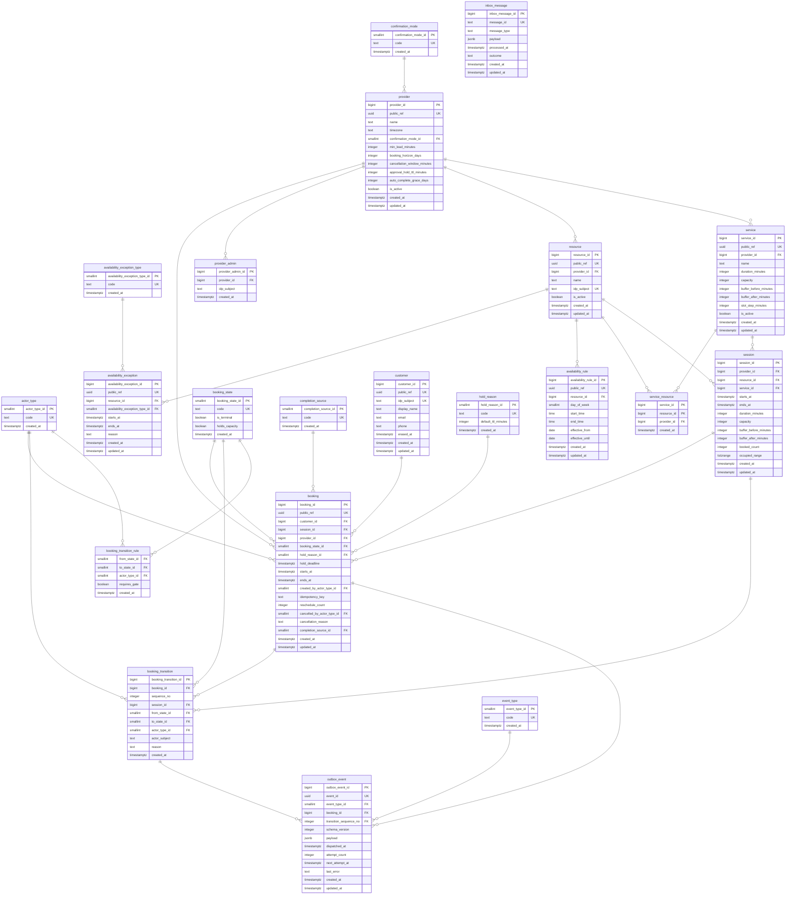

# Booking Service — Data Design

Status: **approved at the phase-1 review gate**
Amendments: phase 2 added `booking_transition.session_id` (OQ15) and
`outbox_event_dispatch_ix` — both await confirmation at the phase-2 gate.
Date: 2026-08-24
Inputs: `requirements.md` r4 (approved at the phase-0 gate)
Artifacts: `data-dictionary.yaml`, `ddl/01-create-tables.sql`,
`ddl/02-create-indexes.sql`, `ddl/03-functions.sql`, `ddl/04-seed-lookups.sql`

---

## 1. Requirements interpretation

### 1.1 The constraint everything else bends around

Three requirements are structural rather than behavioural, and between them they
decide the schema:

- **R1 + R31 + NF4** — a resource may host at most one occupied session at a
  time, buffers included, and that must be *store-enforced*, never a
  check-then-write in application code.
- **R2** — within one session, bookings may coexist up to capacity.
- **R22** — a state transition and its outbound event must commit together.

Postgres can enforce the first declaratively, and that single fact drives the
engine choice (§3), the central table (§2.2) and every write path (§4). The
design is built outward from it.

### 1.2 What availability is, and is not

Requirements deliberately left open whether availability is materialised into
slot rows or computed on read (traceability note, r4). **It is computed.** The
only rows describing time are `availability_rule`, `availability_exception` and
real occupancy in `session`. Nothing is generated ahead of time.

Materialising slots would mean ~2 000 resources × 90 days × ~32 starts ≈ 5.8M
rows that must be regenerated whenever a rule is edited, a service's duration
changes, or the horizon moves — and every one of those regenerations is a
chance for published availability to disagree with reality. R26 already says
availability is derived and never edited directly; computing it on read makes
that structural instead of aspirational. The cost is a slightly heavier read
path, which §5 indexes for and §7 measures.

### 1.3 Open questions and assumptions

Every ambiguity resolved by assumption is listed here. **OQ1 and OQ14 are
amendments to an approved document** and are flagged at the gate.

| id | Question | Resolution | Consequence if wrong |
|----|----------|-----------|----------------------|
| **OQ1** | R31 says adjoining sessions are separated by "the larger of" the two buffers. Is max or sum intended? | **Amended to sum.** Max cannot be expressed as a range overlap, so enforcing it would require a trigger doing read-then-decide — precisely the pattern NF4 forbids. Sum is also the better physical reading (A's cleanup and B's setup are different activities on one resource), and with per-service before/after knobs any desired gap is still expressible: for a 15-minute total gap set after=15, before=0. | Gaps between differently-buffered sessions are wider than a provider expects. Visible immediately in availability; correctable by lowering one side's buffer. |
| **OQ14** | R25 says a booking snapshots "the service at booking time". Which values does the *second* booking into an existing group session get? | **The session is authoritative, not the service row.** A booking joining an existing session inherits that session's duration, capacity and buffers. For a group class this is plainly right — everyone in one class attends the same class. Requirements r5 restates R25 accordingly. | A provider who edits a service mid-day expects the change to apply to a class already partly booked. It applies to the next session instead. |
| OQ2 | Requirements never state which start times are offered. | Per-service `slot_step_minutes`, default 15, with candidate starts aligned to the **beginning of each availability window** rather than to the wall clock, so a 09:07 window opening yields 09:07, 09:22, … predictably. | Providers may want wall-clock alignment. One column, no structural change. |
| OQ3 | R14 requires DST-correct expansion, but not what happens to a local time that does not exist (spring forward) or occurs twice (autumn back). | Postgres `AT TIME ZONE` semantics are taken as the rule: a non-existent local time maps forward, an ambiguous one resolves to the first (pre-transition) occurrence. Not hand-rolled. | Affects only providers whose windows straddle 02:00–03:00 on two nights a year. |
| OQ4 | Can an availability window cross midnight (a bar open 22:00–02:00)? | **No.** `end_time > start_time` is enforced; a provider needing overnight hours writes two rules. | A late-night provider must split rules. Relaxing this later means dropping one CHECK and expanding across the date boundary. |
| OQ5 | May a booking join a session whose snapshot differs from the current service? | Yes — see OQ14. The session row is authoritative until it empties. | See OQ14. |
| OQ6 | Requirements never specify the API's identifier scheme; NF5 implies ids must not leak volume. | `bigint` identity primary keys internally, plus a `public_ref uuid` (v7) on every externally addressable entity. UUIDv7 rather than v4 so inserts stay index-local. | None foreseen; both are present from the start. |
| OQ7 | `session.booked_count` duplicates a fact derivable from `booking`. | Kept, because the capacity guard must be a single conditional UPDATE (§4). Only the functions in `03-functions.sql` write it; §6 carries a reconciliation query for drift. | Drift would over- or under-state availability. Detectable by the query; no data loss. |
| OQ8 | `booking` copies `provider_id`, `starts_at`, `ends_at` from its session. | Kept. Three hot paths — the customer timeline, the cancellation-window test and the auto-complete sweep — would otherwise join `session` and `resource` on every row. Written only by the booking functions, which repoint all three together on reschedule. | Same class of risk as OQ7, same reconciliation. |
| OQ9 | PD14 (resource selection when several are eligible) — database or application? | **Application.** It is policy, not an invariant, and `fn_search_availability` already returns every eligible resource with its remaining capacity, which is the input that decision needs. | None; the DB neither helps nor hinders. |
| OQ10 | NF5 requires erasure, PD9 leaves the period open. | PII columns are nullable and cleared in place, with `customer.erased_at` recording the event. Booking history and `customer_id` survive, so statistics and provider records stay intact. | If regulation demands the row disappear entirely, bookings would need anonymised re-pointing. Flagged for PD9's decider. |
| OQ11 | R33 requires gate selection to be policy-evaluated. Where does that live? | **Application.** `fn_create_booking` takes `p_hold_reason_id` from the caller. The database enforces invariants; the application decides policy. This is what keeps a future short-notice gate (PD19) additive. | None foreseen. |
| OQ12 | `outbox_event.event_id` — is it required to be UUIDv7? | No. Application-minted events use v7; the two database sweeps mint v4 via `gen_random_uuid()`. Event *ordering* is carried by `transition_sequence_no` (R29), never by the id, so the version is irrelevant to consumers. | None. |
| **OQ15** | Phase 2 found that `booking_transition` recorded *states* but not *which session* the booking sat on, so a reschedule erased the previous time entirely — R23's history was incomplete and `BookingRescheduled` could not say what the booking moved from. | **Backtracked and fixed.** `booking_transition.session_id` added (NOT NULL, FK). History is now complete, and the reschedule event reports `previousStartsAt`/`previousEndsAt` derived from the immediately preceding transition. | Would have surfaced as an unanswerable audit question and a vague reschedule notification. |
| OQ13 | What happens if one booking in a sweep raises? | The sweep aborts and retries on its next run; it is idempotent, so no work is lost. Per-row error quarantine is deliberately **not** built here — it is an operational concern for phase 2/4. | A permanently-bad row would stall its sweep. Detectable via NF11 alerting. |

---

## 2. Entity model

### 2.1 Diagram

The diagram below is generated from the live schema, as is
`data-dictionary.yaml` — both come from the same `COMMENT ON` metadata, so the
diagram, the dictionary and `ddl/` agree column-for-column by construction
rather than by proofreading.



### 2.2 `session` — why this table exists

`session` is the load-bearing table, and it is the one thing in this schema a
reader should understand before anything else.

Requirements R1 defines a session as `(resource, service, start, end)` — the
unit a resource is actually occupied by — and says a resource hosts **at most
one at a time**, while a single session holds up to `capacity` bookings. Making
it a real row rather than an implied grouping turns that sentence into two
database constraints:

```sql
CONSTRAINT session_identity UNIQUE (resource_id, service_id, starts_at),
CONSTRAINT session_no_overlap
    EXCLUDE USING gist (resource_id WITH =, occupied_range WITH &&)
    WHERE (booked_count > 0)
```

- `session_identity` is what lets a second customer **join** a group class: the
  booking path is an upsert, and a conflict on this key means "join it", not
  "reject".
- `session_no_overlap` is what stops a *different* session existing over the
  same time — different service, different start, or merely too close given the
  buffers. It is a GiST index, so the guarantee is held by the index and two
  concurrent transactions cannot both win.

`occupied_range` is `[starts_at - buffer_before, ends_at + buffer_after)`. This
is where OQ1 bites: expanding both sides and testing overlap enforces the
**sum** of adjoining buffers, and no range formulation yields the max.

It is maintained by a `BEFORE` trigger rather than declared `GENERATED`, for a
non-obvious reason worth recording: `timestamptz + interval` is **STABLE, not
IMMUTABLE** (adding month or day intervals depends on the session timezone), and
Postgres rejects a generation expression that is not immutable. This was
confirmed against a live server, not assumed.

The `WHERE (booked_count > 0)` predicate carries real weight. A session emptied
by cancellations stops occupying its time, so the slot returns to sale; the row
survives for history. And because updating `booked_count` from 0 to 1 makes the
row *enter* the partial index, refilling an emptied session is re-checked
against whatever took the space meanwhile — verified in §7, T-f.

### 2.3 The other tables, briefly

| Table | Why it exists |
|-------|---------------|
| `provider`, `resource`, `service` | UC1. Policy values from R4–R8 and R13 live on `provider`; duration, capacity and buffers from LD7/LD17 live on `service`, because they vary per offering. |
| `service_resource` | UC1 eligibility. Its foreign keys are **composite**, carrying `provider_id`, so the database itself refuses to link a service to another provider's resource — cross-tenant leakage prevented structurally rather than by a service-layer check. |
| `availability_rule` | UC2. Wall-clock local times plus a day index, expanded per date against the provider timezone (R14). Ending a rule is `effective_until`, not deletion (R20), so there is one truth about whether it applies. |
| `availability_exception` | UC3. Absolute instants rather than wall-clock, because an exception names a concrete occasion. BLOCK subtracts and therefore beats both rules and OPEN. |
| `booking` | The customer's claim on one unit of capacity (LD15). Holds the gate (`hold_reason_id`, `hold_deadline`) while HELD. |
| `booking_transition` | R23, append-only. Its `sequence_no` is also the per-booking ordering key consumers use (R29), so audit and event ordering are the same fact. It records `session_id` as well as the states, so a reschedule does not erase where the booking came from (OQ15). |
| `booking_state`, `hold_reason`, `actor_type`, … | Statuses as lookup rows, never strings or magic numbers. `booking_state` carries `is_terminal` and `holds_capacity`, so the functions read behaviour from data instead of hard-coding state ids. |
| `booking_transition_rule` | The permitted-move table of requirements §4.1 **as data**. `fn_transition_booking` admits a move only if a row matches, so the forbidden-transition list is enforced by the seed and is testable by querying it. |
| `outbox_event` | R22. See §4.3. |
| `inbox_message` | R29 deduplication for consumed messages (UC14). Built now, though the only envisaged producer (payment) is not (LD10). |

`hold_reason` deserves a note: LD16 promised that adding a gate is not a
state-machine change. Here that promise is literal — adding `AWAITING_PAYMENT`
is `INSERT INTO hold_reason VALUES (2, 'AWAITING_PAYMENT', 15)`, and the expiry
sweep, the capacity accounting and the transition guards all pick it up
unchanged. PD16's 15 minutes is already written into `04-seed-lookups.sql` as a
comment for whoever builds it.

---

## 3. Engine decision: PostgreSQL 18.6

**Chosen: PostgreSQL, minimum version 14, pinned at 18.6 by phase 3.**

The decision is not close, and it is made by NF4 rather than by preference:

1. **The core invariant is cross-row.** "No two sessions on this resource may
   overlap" is a statement about the relationship *between* rows. A document
   database can enforce constraints within a document and offers nothing for
   this; the standard workaround — read the neighbours, decide, write — is
   exactly the check-then-write NF4 forbids. Postgres exclusion constraints
   enforce it in the index.
2. **R22 needs the event and the entity in one transaction.** A transactional
   outbox requires the outbox row and the state change to commit atomically.
   That is an ACID transaction across two tables.
3. **R14 needs real timezone machinery.** DST-correct expansion of wall-clock
   rules is `AT TIME ZONE` with the IANA database, which Postgres ships and
   keeps current.
4. **The model is relational.** 21 tables, 26 foreign-key relationships, and
   tenant isolation (R18) expressed as keys.

Minimum 14 is a hard floor, not a preference: `fn_available_windows` composes
availability from **multiranges** (`range_agg`, and the `+ - *` operators),
which arrived in Postgres 14. Rules union with OPEN exceptions, BLOCK
exceptions subtract, and the result intersects the requested window — three
operators instead of an interval-arithmetic loop.

The floor of 14 is a hard requirement; the pin above it is not. Phase 1 set it
at 16 before the environment was known, and phase 3 — having established the
project is greenfield with no existing database to match — moved it to **18.6**
so the service does not begin life two majors behind: 16 reaches end-of-life
2028-11-09 against 18's 2030-11-14 (`endoflife.date/api/postgresql.json`,
checked 2026-08-24). The whole schema and both scenario suites were re-executed
on 18.6 with identical outcomes (§7). Nothing here depends on a feature above
14, so the floor is unchanged.

**Extension required:** `btree_gist`, so the exclusion constraint can combine
an equality column with a range column. It ships with Postgres contrib and is
available on every managed offering that matters, which matters for LD11's
cloud-agnostic target.

---

## 4. Write paths

Every multi-statement write is one function, one round trip, one transaction.
The division of labour is deliberate: **the application decides policy, the
database enforces invariants.** Which gate a booking must pass (R33) and which
resource to choose (PD14) are the caller's; capacity, overlap and event parity
are the database's.

| # | Operation | Function | Idempotency | Atomicity | Queue |
|---|-----------|----------|-------------|-----------|-------|
| 1 | Create booking (UC5, UC6) | `fn_create_booking` | Caller key, `booking_idempotency_key_uq`; a replay returns the original and emits nothing (R15) | Single function: validation, session upsert, booking, transition, outbox | Emits `BookingHeld` or `BookingConfirmed` |
| 2 | Approve / decline (UC6) | `fn_transition_booking` | Guarded by current state; a replayed resolution finds the booking no longer HELD and is refused (R28) | Single function | `BookingConfirmed` / `BookingDeclined` |
| 3 | Cancel (UC7) | `fn_transition_booking` | Guarded by current state; terminal states refuse | Single function; capacity released in the same transaction | `BookingCancelled` |
| 4 | Reschedule (UC8) | `fn_reschedule_booking` | Guarded by current state; `reschedule_count` records repeats | **Transactional, not compensating** — release and take in one transaction, so a failed take rolls the release back (R9) | `BookingRescheduled` |
| 5 | Mark attendance (UC9) | `fn_transition_booking` | Guarded; COMPLETED and NO_SHOW are terminal and cannot be swapped | Single function | `BookingCompleted` / `BookingNoShow` |
| 6 | Expire lapsed holds (UC11) | `fn_expire_holds` | `FOR UPDATE SKIP LOCKED` plus re-evaluation under lock; safe on many instances | Per booking, via path 3's machinery | `BookingExpired` |
| 7 | Auto-complete (UC12) | `fn_auto_complete` | Only CONFIRMED rows are candidates, so a provider's mark is never overridden | Per booking | `BookingCompleted`, source SYSTEM |
| 8 | Consume gate resolution (UC14) | `fn_transition_booking`, else `fn_record_gate_rejection` | `inbox_message.message_id` unique — a redelivery is a no-op (R29) | Inbox row and effect in one transaction | Outcome event, or `BookingGateResolutionRejected` |
| 9 | Dispatch events (UC13) | Application dispatcher | `outbox_event.dispatched_at`; at-least-once, consumers dedupe on `event_id` | Independent of booking writes by design | This *is* the queue path |
| 10 | Manage rules / exceptions (UC2, UC3) | Plain DML | Natural — these are edits, not transitions | Single statement | None. R20: never cancels a booking; conflicts are **reported** by re-running §6's conflict query |

### 4.1 Why the capacity guard is not a read

The whole booking path reduces to one statement:

```sql
INSERT INTO session (...) VALUES (...)
ON CONFLICT (resource_id, service_id, starts_at) DO UPDATE
    SET booked_count = session.booked_count + 1
    WHERE session.booked_count < session.capacity
RETURNING session_id, starts_at, ends_at
```

Three outcomes, no reads: a new session (the exclusion constraint decides
whether it may exist), a join (the `WHERE` decides whether there is room), or
nothing returned, which means full. Two transactions racing for the last unit
produce exactly one winner — the loser blocks on the row lock, re-evaluates the
`WHERE` after the winner commits, and matches zero rows. Verified in §7.

### 4.2 Reschedule releases before it takes

Deliberate, and it matters for a case that would otherwise be impossible: moving
a booking *within its own buffer shadow* — a 10:00 haircut with a 15-minute
after-buffer moving to 10:15. Releasing first drops the old session out of the
partial exclusion index, so the space it was occupying is genuinely free when
the take is attempted. Because both happen in one transaction, a failed take
rolls the release back and the booking is left untouched (verified, §7 T16).

### 4.3 The outbox is enforced, not merely intended

R22's "no committed transition without its event" is usually a convention. Here
one direction of it is a constraint:

```sql
CONSTRAINT outbox_event_per_transition UNIQUE (booking_id, transition_sequence_no),
FOREIGN KEY (booking_id, transition_sequence_no)
    REFERENCES booking_transition (booking_id, sequence_no)
```

An event for a transition that does not exist is rejected by the foreign key; a
second event for the same transition is rejected by the unique constraint. Both
verified in §7 (T12). The reverse direction — a transition that somehow lacks
its event — cannot be a constraint without circularity; it is guaranteed by
`fn_transition_booking` being the only writer of `booking_state_id`, and
monitored by §6's parity query.

`transition_sequence_no` is nullable for one reason: `BookingGateResolutionRejected`
(R28) fires *because nothing changed*, so it has no transition to point at. NULL
rows are exempt from both the unique constraint and the foreign key, which is
exactly right — a booking may accumulate several rejections.

---

## 5. Index plan

| Index | Access pattern | Requirement |
|-------|----------------|-------------|
| `session_no_overlap` (GiST, partial) | "Does anything occupy this resource then, buffers included?" — the availability subtraction and every booking write | R1, R31, NF4 |
| `session_identity` (unique) | The upsert conflict target: join an existing session or open a new one | R2, LD15 |
| `session_resource_starts_at_ix` | Ordered scan of one resource's occupancy over a window (provider calendar) | UC10 |
| `session_service_ix` | Sessions of one service, for admin and reconciliation | ops |
| `booking_idempotency_key_uq` (partial unique) | Replay detection; partial because most bookings carry no key | R15 |
| `booking_customer_timeline_ix` | "My bookings", newest first, paginated | UC10 |
| `booking_provider_timeline_ix` | A provider's calendar, always tenant-filtered | UC10, R18 |
| `booking_session_ix` | Everyone attending one session; capacity reconciliation | UC6, ops |
| `booking_hold_deadline_ix` (partial) | The expiry sweep. Partial on `hold_deadline IS NOT NULL`, which the `booking_hold_pair` CHECK makes equivalent to "is HELD" — so the predicate needs no state literal and cannot rot if state ids change | UC11 |
| `booking_state_ends_at_ix` | The auto-complete sweep, scanning CONFIRMED by end time | UC12 |
| `availability_rule_lookup_ix` | Expanding one resource's rules over a date range | UC2 |
| `availability_exception_range_gix` (GiST) | Exceptions overlapping a window | UC3 |
| `outbox_event_pending_ix` (partial) | The dispatcher's poll, in backoff order. Partial, so it holds only undelivered rows and stays small however large the table grows | UC13, NF11 |
| `outbox_event_dispatch_ix` (partial) | The dispatcher taking the **oldest undispatched row per booking**, which is what per-booking event ordering requires — added by phase 2 (architecture-design.md AQ6) | R29, UC13 |
| `outbox_event_booking_ix` | Operator view of one booking's event history | NF11 |
| `inbox_message_unprocessed_ix` (partial) | Messages still in flight | UC14 |
| `provider_admin_subject_ix` | "Which providers does this subject administer?", on every provider request | R18 |
| `resource_provider_ix`, `service_provider_ix` | Listing a provider's resources and services | UC1 |
| `service_resource_resource_ix` | The reverse of the primary key: "what can this resource perform?" | UC4 |

Two ops paths are indexed on purpose rather than by reflex: `booking_session_ix`
and `outbox_event_booking_ix` serve no user-facing use case, but both are the
query you reach for at 3am with only one id in hand.

---

## 6. Reconciliation and health queries

The two denormalisations (OQ7, OQ8) and the unenforceable direction of R22
(§4.3) each get a query that proves them, intended for a scheduled check:

```sql
-- Capacity drift: booked_count must equal the capacity-holding bookings (OQ7).
SELECT s.session_id, s.booked_count, count(b.booking_id) AS actual
  FROM session s
  LEFT JOIN booking b ON b.session_id = s.session_id
   AND b.booking_state_id IN (SELECT booking_state_id FROM booking_state WHERE holds_capacity)
 GROUP BY s.session_id, s.booked_count
HAVING s.booked_count <> count(b.booking_id);

-- Denormalisation drift: a booking's times and provider must match its session (OQ8).
SELECT b.booking_id FROM booking b JOIN session s USING (session_id)
 WHERE (b.starts_at, b.ends_at, b.provider_id) IS DISTINCT FROM (s.starts_at, s.ends_at, s.provider_id);

-- R22 parity: every transition must have produced exactly one event.
SELECT t.booking_id, t.sequence_no FROM booking_transition t
  LEFT JOIN outbox_event o ON o.booking_id = t.booking_id AND o.transition_sequence_no = t.sequence_no
 WHERE o.outbox_event_id IS NULL;

-- R20 conflicts: non-terminal bookings no longer inside published availability,
-- which is what UC2 and UC3 must return to the provider after a rule edit.
SELECT b.booking_id, b.starts_at FROM booking b
  JOIN session s USING (session_id)
  JOIN booking_state bs ON bs.booking_state_id = b.booking_state_id
 WHERE NOT bs.is_terminal
   AND NOT (fn_available_windows(s.resource_id, b.starts_at, b.ends_at)
            @> tstzrange(b.starts_at, b.ends_at, '[)'));
```

---

## 7. Verification record

The schema was executed against PostgreSQL 16, and again against 18.6 when
phase 3 moved the pin, not merely reviewed. Both runs produced identical
outcomes. Two
constructs failed on contact with a real server and were corrected:

- `CHECK (timezone IN (SELECT name FROM pg_timezone_names))` — **illegal**; a
  CHECK may not contain a subquery. Replaced with the immutable
  `AT TIME ZONE` form, which raises on an unrecognised zone name.
- `occupied_range` as a `GENERATED` column — **rejected**, because
  `timestamptz + interval` is STABLE. Replaced with a `BEFORE` trigger.

A third defect surfaced only under test: `fn_transition_booking` accepted a
**replayed gate resolution** on an already-confirmed booking, because
`CONFIRMED → CONFIRMED by PROVIDER` is a legal row (it records a provider
reschedule) and the duplicate approval matched it. R28's guard was one-directional
— it required a gate when the rule expected one, but did not refuse a gate when
the matched rule expected none. Now symmetric.

| Check | Result |
|-------|--------|
| All four DDL files load into an empty database | clean on 16 and on 18.6 |
| Every table and every one of 161 columns carries a `COMMENT ON` | 21/21, 161/161 |
| R14 — a 09:00 local rule across the 2026-03-29 DST change | 08:00Z before, 07:00Z after |
| NF4 — two transactions racing for the last capacity unit | one `UPDATE 1`, one `UPDATE 0`; final `1/1`, never 2 |
| R1/R31 — overlapping session on one resource, buffers included | rejected, `BK001` |
| R31 — buffer removes 10:30 from availability, leaves 10:45 | correct |
| Emptied session stops blocking; refilling it is re-checked | rejected once the space was taken |
| R15 — idempotent replay | original returned, outbox unchanged at 1 row |
| R2 — group session takes 3, refuses the 4th | `3/3`, `BK002` |
| R3, R4, R5 — outside hours, lead time, horizon | `BK003`, `BK004`, `BK005`; provider bypasses lead time |
| R6, R27 — cancellation window, cancel after start | `BK007`, `BK006` |
| R9 — reschedule onto occupied time | failed and left the booking untouched |
| UC11 — expiry sweep | hold deadline capped at start time; capacity released |
| R28 — resolution arriving after expiry | refused; rejection event reports actual state `EXPIRED` |
| R12, UC12 — attendance before end; auto-complete | `BK009`; completed with source SYSTEM |
| R22 — one event per transition | 14/14 parity; duplicate and orphan events both rejected by constraints |

The scenario scripts live in the session scratchpad and are **not** part of the
deliverable — they are throwaway proofs. Phase 4 owns the real test suite, and
NF10 requires every one of the above as an automated test.

---

## 8. Schema evolution

Migrations are numbered directories with the same per-concern split as `ddl/`
(`tables`, `indexes`, `functions`, `seed`). Additive changes first; a column is
added nullable, backfilled, then constrained.

**Cheap by construction** — these were designed to be data changes, not schema
changes:

- A new gate (`AWAITING_PAYMENT`): one `hold_reason` row. The state machine,
  the expiry sweep and capacity accounting need no change (LD16, PD16).
- A new event type: one `event_type` row (UC13).
- A new permitted transition, or withdrawing one: a `booking_transition_rule`
  row. The forbidden-transition list is data.
- A new booking state: a `booking_state` row plus its transition rules. The
  functions read `is_terminal` and `holds_capacity`, so no branch changes.

**Expensive, and worth knowing in advance:**

- Changing buffer semantics from sum to max (reversing OQ1) is not a migration
  but a redesign — it surrenders the exclusion constraint and therefore NF4.
- Materialising availability (reversing §1.2) would add a table and a
  regeneration path on every rule edit.
- Allowing one booking to take several capacity units (PD12/LD15) means
  `booking` gains a `units` column and `booked_count` sums it rather than
  counting rows. Additive, but it touches every capacity guard.
- Overnight availability windows (OQ4) means dropping one CHECK and expanding
  rules across the date boundary.

**On migration guards:** an `information_schema` test that can never match makes
its guarded statement silently never run — the failure mode is a migration that
reports success and does nothing. Every guard must be proven to match *before*
the change is applied, by running it against a copy of production and asserting
a non-empty result.

---

## 9. Consistency with requirements

`requirements.md` is amended to r5 alongside this document, for OQ1 (R31: sum,
not max) and OQ14 (R25: the session is authoritative). Phase 2 amended this
document in turn, for OQ15 (`booking_transition.session_id`) and the dispatch
index above — both re-verified against a live server, with the phase-1 scenario
suite re-run and identical. Both are recorded there
and at this gate — there is no forked truth between the two documents.

Requirements PD items this design touches without resolving, left to their
deciders: PD4 (grace period), PD5 (reschedule limit), PD9 (retention), PD13
(overlapping customer bookings — currently permitted, nothing in the schema
prevents it), PD14 (resource selection, see OQ9).
